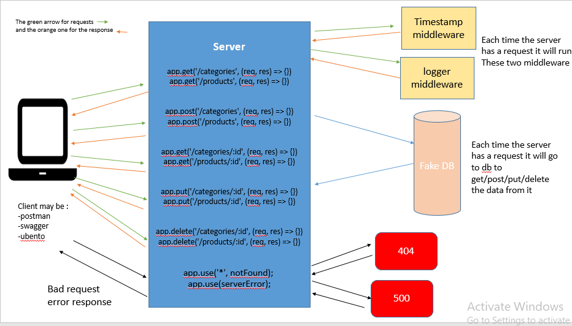

# api-server2

## Author: Israa Othman 

## Links and Resourcs 
  - [Swagger](https://app.swaggerhub.com/apis/israaothman/apiServer2/0.1)
  -  [lab-07 PR](https://github.com/401-advanced-javascript-israaOthman/api-server2/pull/1)  
  -  [lab-08 PR](https://github.com/401-advanced-javascript-israaOthman/api-server2/pull/3)  

  ## Setup 
   - `.env` requirment 
     - PORT - 3030

  # UML 
    
